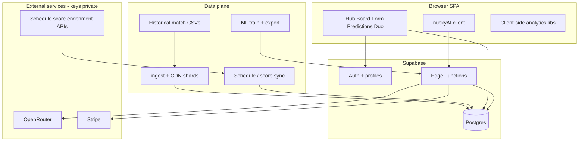

# Architecture overview

High-level system design for [nucky.gg](https://nucky.gg). Proprietary billing, RAG indexer, and full production schema details are intentionally omitted from the public repo.

## System context

## Product composition

| Surface | Role |
|---------|------|
| **Hub** | Catch-up on concluded series, standouts, weekly/monthly recaps |
| **Board** | Upcoming schedule and foresight entry points |
| **Form** | Players / Teams / Champions current-form boards |
| **Predictions** | Matchup foresight UI + model packets (deeper foresight gated) |
| **Duo** | Subscriber split view of dashboard + analyst context |
| **nuckyAI** | Authenticated SSE analyst over stats tools + RAG |

## Dashboard (public in this repo)

1. **Load** — dashboard store fetches OE / warehouse shards (Supabase + CDN).
2. **Filter** — league + year + split; `mergeSlices()` builds the active cohort.
3. **Compute** — pure TypeScript modules derive radars, form, standouts, tournament views.
4. **Render** — Recharts + GSAP / Lenis motion on landing and app shell.

No application server for the SPA: Cloudflare Pages + Supabase PostgREST / edge.

## nuckyAI (SaaS)

Public portfolio review includes the **chat UI** and `supabase/functions/agent-chat/` orchestrator. Revenue-critical billing sync and the RAG embedding indexer remain private.

At a high level:

| Stage | Description |
|-------|-------------|
| Auth + quota | Supabase session; subscription / usage gates |
| Guardrail | Refuse off-topic before tool / LLM spend |
| Tools | Deterministic stats / schedule tools + pgvector RAG + allowlisted enrichment |
| Synthesis | OpenRouter SSE grounded on retrieved evidence |
| Predictions | Exported ML artifacts loaded at the edge for matchup packets |

## Billing (SaaS — private handlers)

- Stripe Checkout for nuckyAI subscription
- Customer portal for cancel / renew
- Webhook sync into subscriptions / profiles (implementation not published)

## Data refresh (public CI)

`refresh-data.yml` (~every 2 hours):

1. Change-detect current match source data
2. Ingest → CDN shards → Supabase seed when changed
3. Sync schedules / series scores
4. Generate concluded-series recaps
5. Optionally retrain / publish ML artifacts

## Security model (summary)

- Row Level Security on user-owned tables
- Service role only on edge workers and CI
- Anon key in frontend for permitted reads
- No service role, LLM, Stripe secret, or enrichment API keys in the client bundle

See [PRIVATE_COMPONENTS.md](./PRIVATE_COMPONENTS.md) for what is excluded from GitHub.
