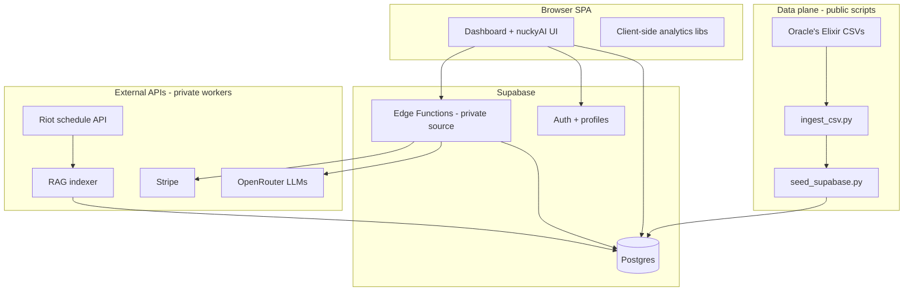

# Architecture overview

High-level system design for [nucky.gg](https://nucky.gg). Implementation details for proprietary services are intentionally omitted from the public repo.

## System context

## Dashboard (public in this repo)

1. **Load** — `loadOEStoreFromSupabase()` fetches all `oe_slices` rows once.
2. **Filter** — `DashboardContext` applies league + split; `mergeSlices()` builds the active cohort.
3. **Compute** — Pure TypeScript modules (`championAnalytics`, `playerRadar`, `teamAnalytics`, `matchupAnalytics`) derive charts and tables.
4. **Render** — Recharts + custom GSAP scroll choreography.

No application server: the dashboard is a static SPA on Cloudflare Pages with runtime reads from Supabase PostgREST.

## nuckyAI (SaaS — private backend)

Product behavior (source not in public repo):

| Stage | Description |
|-------|-------------|
| Auth + quota | Supabase session; daily/monthly usage caps |
| Intent | Classify whether the question needs stats, external context, or both |
| Deterministic tools | OE-backed matchup, rankings, champion meta, team form, lane matchup, schedule lookup |
| Compare | Server-side team/player radar payloads streamed before LLM text |
| RAG | pgvector search over `documents` with source/kind filters |
| Synthesis | OpenRouter streaming completion grounded on `[DATABASE_RESULTS]` + `[EXTERNAL_CONTEXT]` |
| Persist | Conversations and messages in Postgres |

The public repo includes the **chat UI** and `useAgentChat` SSE client only.

## Billing (SaaS — private)

- Stripe Checkout for Pro subscription
- Customer portal for cancel / renew
- Webhook sync into `subscriptions` + `profiles.is_subscribed`

## Data refresh (public CI)

`refresh-data.yml` (Sunday 22:00 UTC): download OE CSVs → ingest → seed → verify → commit JSON backup shards.

RAG re-indexing runs on a separate private schedule (Liquipedia, patch notes, Reddit, Kalshi, tier-1 schedules).

## Security model (summary)

- Row Level Security on user-owned tables
- Service role only on edge workers and CI
- Anon key in frontend for read-only dashboard slices
- No service role or LLM keys in the client bundle

See [PRIVATE_COMPONENTS.md](./PRIVATE_COMPONENTS.md) for what is excluded from GitHub.
